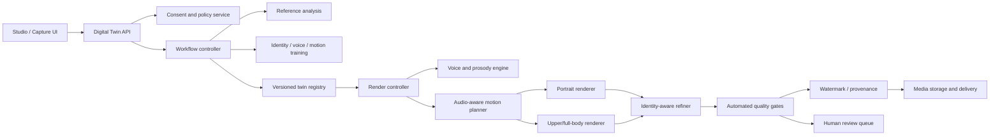
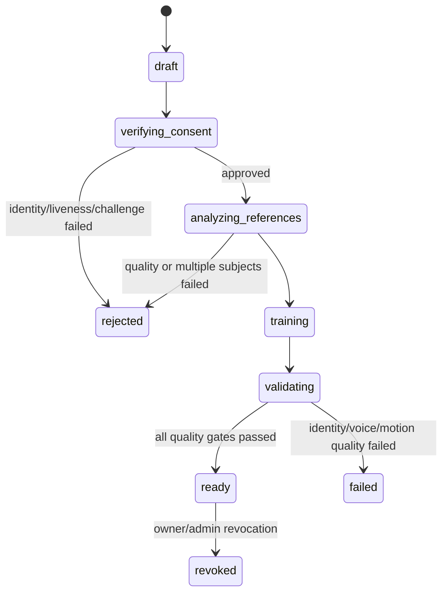

# VISUS Digital Twin V2 Architecture

## Objective

Build a consent-verified personal avatar platform that preserves four kinds of
identity across new scripts and languages:

1. **Visual identity:** geometry, teeth, skin texture, hair, accessories, and
   stable identity under pose and lighting changes.
2. **Voice identity:** timbre, accent, speaking rate, pauses, emphasis, and
   emotion.
3. **Behavioral identity:** habitual expressions, gaze, nods, posture, and
   co-speech gestures.
4. **Operational identity:** versioned assets, reproducible renders, revocation,
   provenance, and a complete audit trail.

This is materially larger than lip sync. HeyGen's published Avatar V system
uses full video-reference conditioning, a separate motion stream, audio
cross-attention, identity/lip-sync/motion losses, identity-aware super
resolution, and production-scale data curation. The VISUS architecture mirrors
those responsibilities while allowing incremental local implementations.

Primary references:

- [HeyGen Avatar V technical report](https://dynamic.heygen.ai/www/Paper%20Links/avatarv_tech_report.pdf)
- [HeyGen avatar lifecycle API](https://developers.heygen.com/reference/create-avatar)
- [HeyGen consent-video requirements](https://help.heygen.com/en/articles/12092609-recording-your-consent-video)
- [LivePortrait official implementation](https://github.com/KlingAIResearch/LivePortrait)
- [MuseTalk 1.5 official implementation](https://github.com/TMElyralab/MuseTalk)

## System boundary



The existing `TTS -> LivePortrait -> MuseTalk -> restoration` path implements
one `PortraitRenderer` adapter. It is the fallback/preview engine, not the whole
Digital Twin product.

## Repository structure

```text
services/avatar/
  digital_twin/
    domain.py          # lifecycle, training, render and quality objects
    ports.py           # interfaces for every swappable engine
    orchestrator.py    # consent-gated training and render DAG
    quality.py         # minimum production acceptance policy
    evaluation.py      # reproducible variant comparisons and claim boundaries
    demo_pack.py       # sequential portfolio experiment and artifact separation
  adapters/            # next phase
    django_repository.py
    celery_workflow.py
    local_portrait.py  # existing LivePortrait + MuseTalk bridge
    video_ref_dit.py
    voice_clone.py
    full_body.py
    quality_models.py
    provenance.py
```

The new model-independent core is implemented under
`services/avatar/digital_twin/`. GPU libraries must not be imported into this
core.

## Avatar lifecycle



Training footage and consent footage are separate artifacts. Consent approval
must check the same subject, liveness, and a session-specific spoken challenge.
Checkbox-only consent is insufficient for a reusable real-person clone.

## Reference ingestion

The capture product should request 60–120 seconds of training footage plus a
separate consent challenge. The analyzer produces a versioned reference
manifest containing:

- face and person presence over time;
- single-speaker and single-subject ratios;
- identity consistency across frames;
- pose, gaze, blink, expression and mouth-shape coverage;
- upper/full-body pose coverage when requested;
- lighting, blur, compression, camera shake and scene-cut scores;
- ASR with word timestamps, diarization and audio-quality scores;
- selected diverse keyframes and useful temporal intervals;
- hashes of every original and derived artifact.

Do not reduce the subject to one face image. Keep a multi-view identity bank and
a temporal performance bank. This is the key structural difference between a
basic talking head and a behaviorally recognizable twin.

## Trainable packages

Each twin owns three separately versioned packages:

| Package | Contents | Can be retrained independently |
| --- | --- | --- |
| Identity | multi-view frames, face/body embeddings, reference tokens, dental/skin details, looks | Yes |
| Voice | speaker tokens, pronunciation profile, prosody/style tokens, supported languages | Yes |
| Motion style | expression/gaze statistics, pose sequences, co-speech gesture vocabulary, motion tokens | Yes |

This separation prevents a new voice sample from invalidating identity training
and allows a better renderer to reuse existing verified identity assets.

## Render DAG

1. Resolve twin version, look, consent and requested capability.
2. Generate or ingest audio.
3. Extract phonemes, energy, pitch, pauses, emotion and word timings.
4. Create a deterministic motion plan for expression, gaze, head, body, camera,
   and gestures.
5. Route to portrait, upper-body, full-body, or streaming renderer.
6. Run identity-aware temporal refinement and high-resolution enhancement.
7. Score identity, voice, lip sync, motion, gaze, anatomy and visual quality.
8. Reject/retry unsafe or low-quality output; never publish a failed render.
9. Apply visible/configurable watermark plus machine-readable provenance.
10. Store an immutable render manifest and publish the media artifact.

The motion plan is a first-class artifact. It makes generation reproducible and
allows the same speech to be rerendered with a new visual model without changing
the intended performance.

## Engine strategy

### Tier 1 — production talking head

- Existing LivePortrait adapter for face/head motion.
- MuseTalk 1.5 adapter for audio-driven mouth animation.
- Voice cloning with speaker and prosody packages.
- Temporal stabilizer and face-region identity refiner.
- 1080p delivery with automated identity/lip-sync gates.

This tier can become a strong presenter avatar, but it will not equal a unified
video-reference diffusion model for unseen gestures or scene changes.

### Tier 2 — personality-conditioned portrait model

- Video-reference token bank instead of a single identity embedding.
- Audio cross-attention at phoneme/frame level.
- Dedicated motion-token prediction and injection.
- Training objectives for identity, lip sync, motion, gaze and perception.
- Long-video chunking with overlap, context cache and boundary consistency.

Implement through `PortraitRenderer`; do not change API/domain contracts.

### Tier 3 — upper/full body

- Dense whole-body pose and hand keypoint extraction.
- Audio/text-to-gesture planner conditioned on personal motion style.
- Pose-conditioned video renderer with identity/reference conditioning.
- Hand, anatomy, occlusion and foot-contact quality gates.

Full body is a distinct capability and worker pool. A failed body renderer must
not silently fall back to a cropped talking head.

### Tier 4 — real-time

- Streaming TTS/audio chunks.
- Stateful motion planner with look-ahead.
- Persistent GPU actors with preloaded twin context.
- Chunked causal decode, WebRTC delivery and interruption handling.

Batch rendering should be stable before this tier starts.

## Quality gates

Initial policy values are encoded in `digital_twin/quality.py` and must later be
calibrated against human ratings:

| Dimension | Initial minimum |
| --- | ---: |
| Identity similarity | 0.82 |
| Voice similarity | 0.78 |
| Lip sync | 0.80 |
| Temporal stability | 0.82 |
| Expression naturalness | 0.72 |
| Gaze naturalness | 0.68 |
| Body anatomy | 0.76 |
| Visual fidelity | 0.78 |

Production evaluation needs a fixed benchmark with held-out scripts, languages,
emotions, durations, camera crops and scene styles. Automated metrics alone are
not a release gate: use pairwise human preference tests and a real-vs-generated
avatar Turing-style evaluation.

Avatar Evaluation Lab V1 implements the first reproducible comparison slice.
It requires generic, personal-motion, and prosody-motion evidence generated
from the same input fingerprint, reports candidate-minus-baseline deltas, and
blocks promotion on quality regressions or missing capability evidence. Its
Markdown scorecard requires blind human review for naturalness and emotion-fit
claims. The protocol and CLI are documented in
`docs/AVATAR_EVALUATION_LAB_V1.md`.

Avatar Demo Pack V1 supplies the artifact-producing layer above that evaluator.
It runs generic, personal-window, and prosody-timeline renders sequentially,
records runtime and best-effort total GPU-memory measurements, verifies actual
motion materialization, and emits a synchronized three-panel video with an
`AI AVATAR DEMO` disclosure. Private individual renders and publishable
portfolio artifacts use separate directories. See `docs/AVATAR_DEMO_PACK_V1.md`.

## API shape

```text
POST   /api/v2/digital-twins/
GET    /api/v2/digital-twins/{id}/
POST   /api/v2/digital-twins/{id}/consent-sessions/
POST   /api/v2/digital-twins/{id}/training-runs/
POST   /api/v2/digital-twins/{id}/consent-sessions/{session_id}/decision/  # staff verifier
POST   /api/v2/digital-twins/{id}/renders/
GET    /api/v2/digital-twins/{id}/renders/{render_id}/
POST   /api/v2/digital-twins/{id}/revoke/
```

Every mutation accepts an idempotency key. Creation and training are
asynchronous. API status mirrors the domain state machine rather than exposing
Celery-specific states.

### Implemented V2 slice

The current repository now implements the API above, durable Django records,
audit events, revocation, idempotent creation/training/render submission, and
the `avatar-verify` / `avatar-train` / `avatar-render` Celery routes. Consent is
deliberately fail-closed. The verification worker first rejects corrupt,
faceless, or multi-subject evidence, then evaluates same-person, liveness, and
the session-specific spoken challenge. Automatic approval requires all three
configured providers to return `assurance=strong`; local OpenCV appearance and
motion checks are prechecks only. Missing or inconclusive providers route the
session to authenticated staff review instead of approving it.

The first renderer adapter is the existing `TTS -> LivePortrait -> MuseTalk ->
restoration` path. It consumes the verified performance video, creates separate
identity/voice/motion manifests, and adds a visible `AI AVATAR` watermark plus
provenance JSON. Motion Style V2 samples the performance recording and stores
face/landmark coverage, head pose, gaze, blinks, expression intensity, motion
intensity, and ranked calm/natural/expressive temporal intervals. Missing
landmark infrastructure is reported as `limited`; it is never presented as a
learned motion model. Motion Planner V2 deterministically maps render emotion
and intensity to one of those personal intervals, passes its start time to the
LivePortrait driver, and records both the intended and executed window. If the
profile is limited or invalid, the existing frame-difference window selector is
used as an explicit fallback. Full-body requests fail explicitly until a body
renderer is installed; they never degrade silently to a talking head.

Prosody-Aware Motion Timing V1 runs after TTS. It decodes the generated speech
to mono PCM, derives a bounded pause/energy/emphasis timeline, biases that
timeline with the requested emotion, and assigns each output segment to a
validated personal Motion Style V2 interval. The LivePortrait adapter builds a
crossfaded, audio-duration-matched driving montage and includes the timeline
hash in its stage cache key. `prosody-profile.json`, `motion-plan.json`, engine
trace, provenance, and render audit fields retain intended and executed timing.
This is deterministic signal-based timing, not a learned semantic gesture or
phoneme-to-motion model.

Provider commands are shell-free argument templates and must emit one JSON
object on stdout. Face/liveness providers return `passed`, normalized `score`,
and `assurance`; the ASR provider returns `transcript` and `assurance`. The
worker independently checks transcript coverage and requires the random spoken
code. Templates receive `{performance_video}`, `{consent_video}`, and
`{challenge_text}` placeholders.

Post-render quality follows the same pattern. Canonical duration, audio,
motion, artifact, and landmark checks always block technical failures. Optional
identity and SyncNet-style lip-sync providers receive `{source_image}`,
`{output_video}`, and `{audio_path}`. In local mode, technically valid output is
published with `decision=review_required`; setting
`DIGITAL_TWIN_STRICT_QUALITY_GATE=1` blocks it until strong identity and
lip-sync signals pass.

### Local RTX 4060 laptop profile

Workers auto-detect NVIDIA memory before V2 training/rendering. GPUs up to
8.5 GB use the `ada_laptop_8gb` profile: FP16, MuseTalk batch 2 (batch 1 in
low-headroom mode), eight-second chunks, one GPU job at a time, per-batch CUDA
cache cleanup, and a 720p delivery ceiling. Explicit operator settings always
win over these defaults. The selected GPU snapshot, profile, and warnings are
written into training manifests and render engine traces.

This profile is intended for inference and product development. It does not
make 8 GB sufficient for training MuseTalk or a unified video diffusion model;
those workloads remain cloud/multi-GPU jobs.

## Storage layout

```text
digital_twins/<twin_id>/
  source/<source_hash>/original.*
  consent/<session_id>/challenge.webm
  analysis/<analysis_version>/manifest.json
  identity/<package_version>/manifest.json
  voice/<package_version>/manifest.json
  motion/<package_version>/manifest.json
  looks/<look_id>/manifest.json
  renders/<render_id>/
    request.json
    motion_plan.json
    quality.json
    provenance.json
    output.mp4
```

Source, consent and package artifacts are encrypted and access-controlled.
Revocation blocks all future renders immediately; deletion is an audited,
asynchronous purge across primary storage, caches and backups according to the
retention policy.

## Worker topology

- `avatar-verify`: evidence decode, prechecks, biometric/liveness/ASR adapters.
- `twin-ingest-cpu`: decode, normalize, ASR and metadata.
- `twin-analysis-gpu`: face/body/audio embeddings and quality signals.
- `twin-train-gpu`: identity, voice and motion packages.
- `twin-render-portrait-gpu`: low-latency portrait generation.
- `twin-render-body-gpu`: larger full-body jobs.
- `twin-refine-gpu`: temporal/identity refinement and super resolution.
- `twin-quality-gpu`: independent post-render scoring.

Use resource-specific queues, idempotent stage manifests, resumable workflows,
and one model residency process per GPU. The current single avatar Celery queue
is suitable for Tier 1 development but not parity-scale production.

## Delivery phases

### Phase A — platform foundation

- Persist Digital Twin V2 models and lifecycle.
- Add separate live consent challenge and same-person verification.
- Implement reference analysis manifest and quality UI.
- Bridge the existing renderer through `PortraitRenderer`.

Exit: a revoked or unverified person can never render; every job is reproducible
from manifests.

### Phase B — premium talking head

- Prosody-preserving voice package.
- Multi-view identity bank and expression-aware motion selection.
- Identity-aware temporal refiner and calibrated quality gates.
- 1080p benchmark and human preference evaluation.

Exit: stable identity, teeth, gaze, lip sync and temporal consistency on held-out
scripts.

### Phase C — behavioral twin

- Audio-aware personal motion planner.
- Video-reference-conditioned portrait model or equivalent provider adapter.
- Emotion and motion-prompt controls.

Exit: judges recognize the subject's talking style, not only their face/voice.

### Phase D — full body and scenes

- Pose/hand pipeline, body renderer, looks and prompted environments.
- Separate anatomy and interaction quality gates.

Exit: stable hands/body and identity across camera and scene changes.

### Phase E — streaming and scale

- Persistent GPU actors, streaming decode, WebRTC, priority/QoS scheduling.
- Multi-region observability, capacity controls and cost accounting.

Exit: measured latency and availability SLOs under concurrent load.
